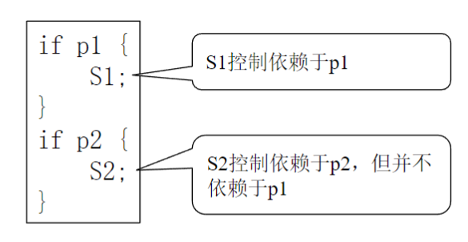
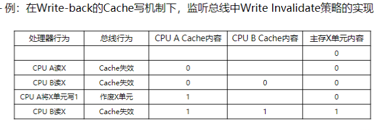
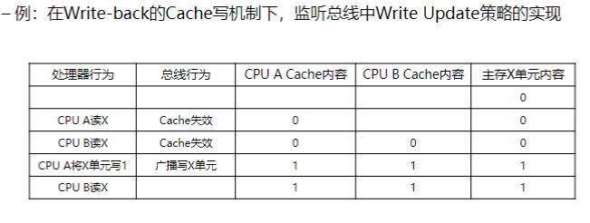
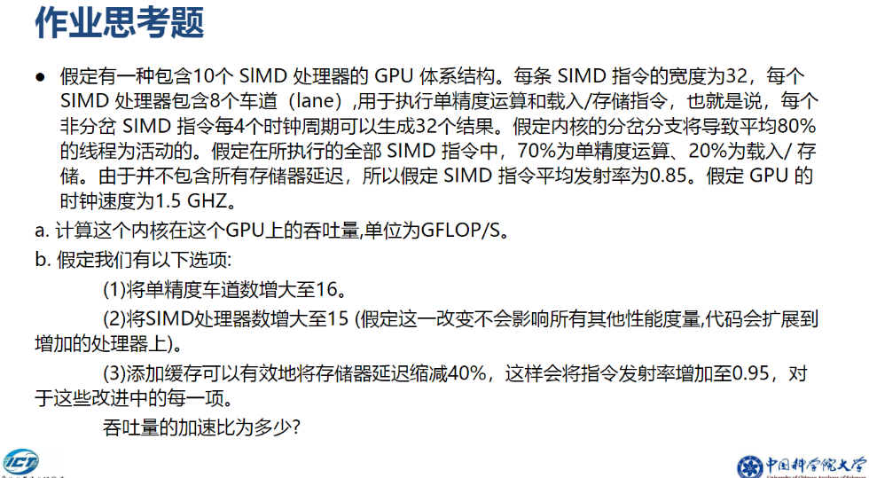
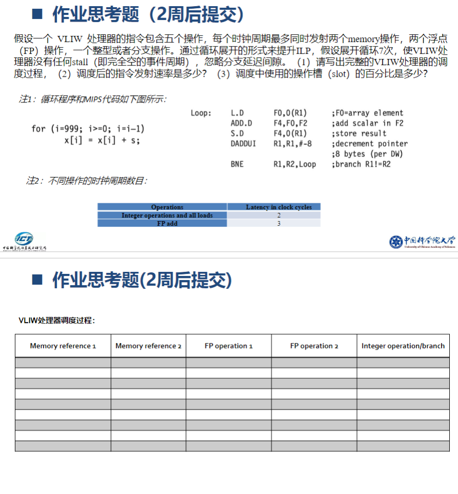
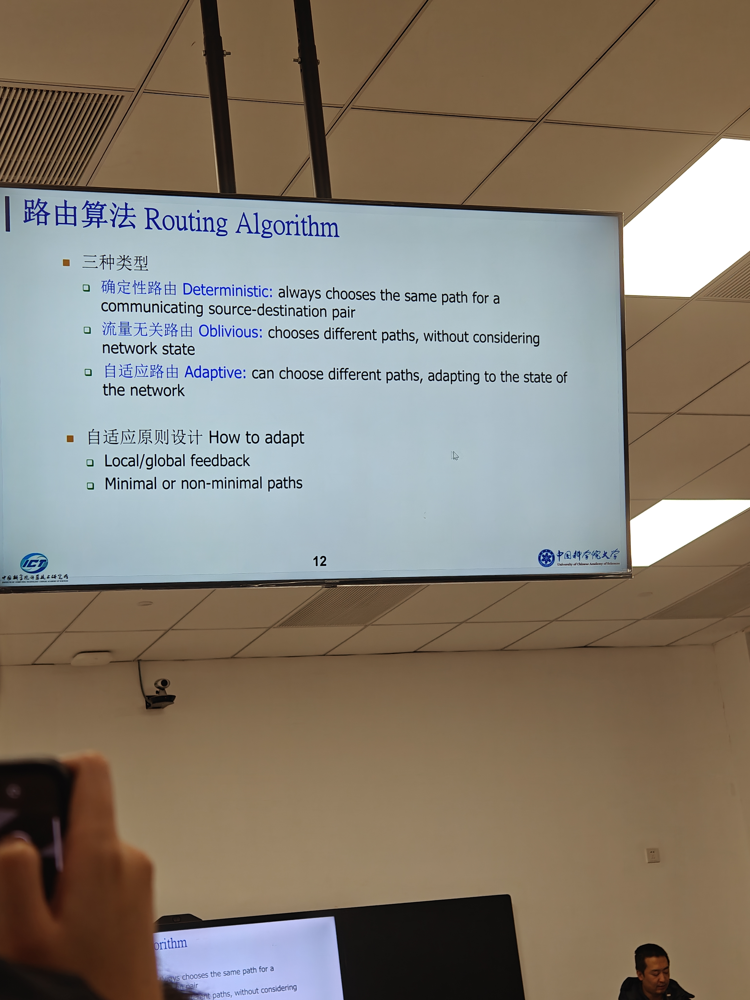
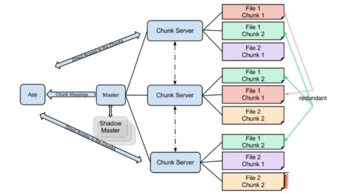
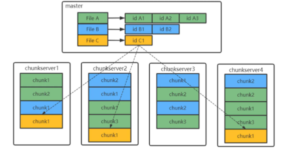
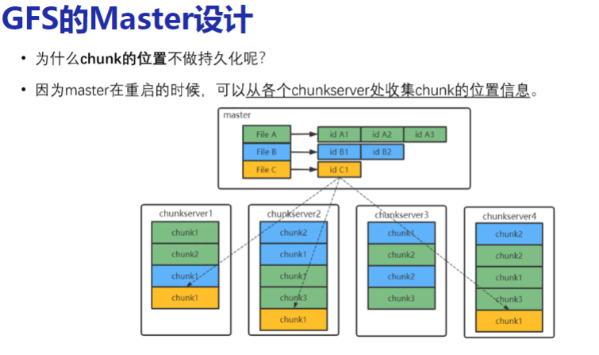
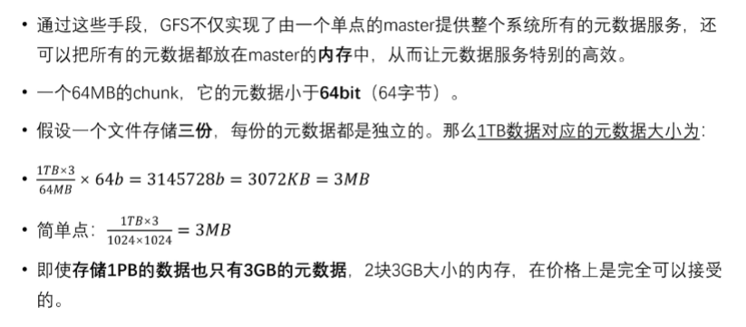

# UCAS——计算机体系架构
# 一、指令流水线
## 1.流水线中的指令依赖关系 
- **数据依赖(Data dependences)**
- **名字依赖(Name dependences)：两条指令使用相同寄存器的名字或引用相同内存位置**
	- 两种类型：
        - antidependence（反向依赖）
        - output dependence（输出依赖）
- **控制依赖(Control dependences)**

    - 是指一条指令i同一条分支指令之间的相关性，这种相关性要求指令i只能在应当被执行的时候才被执行
    
    - 
## 2.RISC处理器的五阶段流水线
RISC（精简指令集计算机）处理器的五阶段流水线是经典的指令执行模型，旨在提高处理器性能。以下是五个阶段的详细描述：

### 1. 取指（Instruction Fetch, IF）
- **功能**：
  - 从指令存储器中读取指令。
  - 根据程序计数器（Program Counter, PC）定位下一条指令的地址。
- **输入**：
  - 当前的`PC`。
- **输出**：
  - 获取到的指令内容。
  - 更新后的`PC`。
- **挑战**：
  - **分支预测**：如果遇到跳转或分支指令，需要预测下一条指令的地址以减少停顿。

---

### 2. 译码（Instruction Decode, ID）
- **功能**：
  - 对取到的指令进行解析。
  - 从寄存器堆中读取操作数。
  - 确定指令类型（如加载、存储、运算或分支）。
- **输入**：
  - 从取指阶段得到的指令。
- **输出**：
  - 译码后的指令信息。
  - 操作数（如果是寄存器操作）。
- **挑战**：
  - **数据冒险**：如果依赖于前一条指令的结果，可能导致停顿。

---

### 3. 执行（Execution, EX）
- **功能**：
  - 根据译码阶段的结果，执行指令的具体操作。
  - 包括算术运算、逻辑运算，或计算跳转地址（分支指令）。
- **输入**：
  - 操作数。
  - 指令信息。
- **输出**：
  - 运算结果或目标地址（对于跳转指令）。
- **挑战**：
  - **结构冒险**：多个指令可能竞争同一硬件资源（如ALU）。

---

### 4. 访存（Memory Access, MEM）
- **功能**：
  - 访问数据存储器。
  - 对加载（`Load`）和存储（`Store`）指令完成内存操作。
  - 如果是普通运算指令，则跳过此阶段。
- **输入**：
  - 从执行阶段得到的目标地址或数据。
- **输出**：
  - 加载的数据（对于`Load`指令）。
- **挑战**：
  - **存储器冒险**：多条指令可能需要同时访问内存。

---

### 5. 写回（Write Back, WB）
- **功能**：
  - 将执行或访存阶段的结果写回寄存器堆，以供后续指令使用。
- **输入**：
  - 从执行或访存阶段得到的结果。
- **输出**：
  - 寄存器堆中被更新的值。
- **挑战**：
  - **结构冒险**：多条指令可能尝试同时写入寄存器。

---

### 五阶段流水线的关键特点

1. **并行性**：
   - 每个阶段彼此独立，可同时处理不同指令，提升吞吐量。

2. **流水线停顿（Stalls）**：
   - **数据冒险**：指令依赖前一条指令的结果，导致停顿。
   - **控制冒险**：分支指令未完成预测时可能停顿。
   - **结构冒险**：硬件资源冲突导致停顿。

3. **分支预测和转发（Forwarding）**：
   - **分支预测**：减少分支冒险导致的停顿。
   - **数据转发**：直接传递结果避免等待寄存器更新。

4. **吞吐量和延迟**：
   - 理论上，流水线每个周期可完成一条指令。
   - 但冒险和停顿可能降低实际性能。

---

### 优化技术

1. **超标量（Superscalar）**：增加多个流水线以同时处理多条指令。
2. **动态调度**：动态调整指令执行顺序以减少停顿。
3. **寄存器重命名**：解决名字依赖问题，避免伪冒险。

---

### 应用场景

RISC处理器的五阶段流水线设计广泛应用于**MIPS**、**ARM**等处理器架构，是现代高性能处理器设计的基础。

---

## 3.流水线上代码的指令周期计算

## 4.流水线的冲突及其解决方法
- **资源冲突**
    - 停顿
- **数据冲突**
    - 前送(Forwarding/bypassing)
        - 核心思想：抄近路
    - 计分板
    - Tomasulo
- **控制冲突**
    - 延迟槽（delayed slot）
        - 核心思想：软硬件协同
    - 分支预测（branch prediction）
    - 高级分支预测
    - 跳转地址预测
    - 返回地址预测

## 5.指令的非流水线实现

# 二、动态调度流水线和计分板算法
## 1.	什么是乱序执行
- 允许就绪指令越过前面的停顿指令，率先投入运行，即乱序执行。
    - 就绪指令：是指不存在资源冲突、操作数已就绪的指令
- 需要对ID阶段进行改造，因为就绪指令是在ID阶段被阻塞的
- 约束条件：ID阶段必须按序执行，因为，前一条指令还未译码，后续的指令就无法进行冲突检测
- 存在的问题：在一个必须按序执行的阶段，执行了过多的检测，导致停顿增加
- 解决方法：将ID阶段拆分为两个阶段
    - Issue：对应之前的ID阶段，但精简操作，只做最必要的事：如指令译码、资源冲突检测
    - Read operands：等待数据冲突消除，然后读取操作数
**乱序执行（Out-of-Order Execution, OoO）** 是现代处理器的一种动态调度技术，允许指令根据操作数的可用性和资源的空闲状态，以不同于程序原始顺序的方式执行。这种技术旨在提高处理器的指令吞吐量和资源利用率。

### **特点**：
- **指令并行性**：利用指令之间的数据独立性，实现指令并行执行。
- **避免停顿**：即使前面的指令因数据依赖或资源限制无法执行，后续指令也可以执行。
- **动态调度**：硬件动态调整指令的执行顺序，而不是依赖编译器的静态优化。

### **优点**：
1. **提高性能**：通过隐藏指令的延迟，提高流水线利用率。
2. **解决数据依赖问题**：结合转发和寄存器重命名，降低数据冒险的影响。
3. **支持复杂架构**：适用于多功能单元、多核处理器等复杂设计。

### **实现乱序执行的关键技术**：
1. **寄存器重命名**：通过动态分配物理寄存器，消除名字依赖（如反向依赖和输出依赖）。
2. **动态调度**：由硬件决定指令的执行顺序，例如使用计分板或Tomasulo算法。
3. **结果回写顺序**：即使指令乱序执行，也要保证结果按照程序原始顺序写回，以确保程序语义正确。
## 2.	计分板算法的原理和实例

# 三、Cache的概念和工作原理
## 1.	什么是Cache？

## 2.	Cache的工作原理

## 3.	Cache在计算机体系结构中的作用

## 4.	Cache的有效依据是什么？

# 四、高速缓存一致性
## 1.	什么是缓存一致性问题
内存、Cache中数据不一致
## 2.	实现监听一致性协议的两种策略
- Write Invalidate（写作废策略）
    - 在一个处理器写某个数据项之前保证它对该数据项有唯一的访问权
    - 当一个处理器更新某共享单元（如存储行或存储页）时（之前或之后），通过某种机制使该共享单元的其它备份作废无效；当其它处理器访问该共享单元时，访问失效，需要重新从主存中读取该单元的新值
    - 
- Write Update（写更新策略）
    - 当一个处理器更新某共享单元时，把更新的内容传播给所有拥有该共享单元备份的处理器
    - 
- 两种策略的区别
    - Write Invalidate通常用于减少数据传输的带宽，因为它只需要发送一个无效信号，而Write Update可能需要发送更多的数据
    - Write Update可以减少读操作的延迟，因为其他处理器可以更迅速地获取到最新的数据
## 3.	根据一致性协议对处理器缓存的状态和值进行跟踪计算MSI协议（3种状态I/S/M）

# 五、虚拟内存
## 1.	虚拟内存的基础机制
- 非直接寻址
- 每个应用程序都使用虚拟地址
  - 不直接使用物理地址
  - 在X86系统中，称为线性地址“linear address”
- 构建一个地址转换机制来把虚拟地址转换为物理地址
  - 物理地址在X86中叫真实地址“real address”
  - 这种映射机制应该可以说纯软件的，也可以是硬件和软件结合的
## 2.	虚拟内存中页、页表和TLB的概念
- 页：虚拟内存中的最小单位
- 页表：页表是虚拟内存管理的核心数据结构，用于将虚拟地址映射到物理地址
- TLB：TLB是CPU中的高速缓存，用于存储最近使用的页表项，以加速地址转换过程

## 3.	根据给定的处理器位数、页大小和页表项大小，计算页表大小
## 问题描述
已知以下条件：
- **处理器位数**：64 位
- **每页大小**：1 MB
- **每个页表项大小**：8 字节

需要计算：
1. **页的数量**。
2. **每个用户的页表大小**。

---

## 解题步骤

### 步骤1：计算虚拟地址空间大小
根据处理器位数，虚拟地址空间的总大小为：
虚拟地址空间大小 = 2^64 字节

### 步骤2：计算页的数量
每页大小为 1 MB，即：
每页大小 = 2^20 字节

页的数量计算公式为：
页的数量 = 虚拟地址空间大小 ÷ 每页大小

将数值代入：
页的数量 = 2^64 ÷ 2^20 = 2^44

因此，页的数量为 **2^44 个**。

### 步骤3：计算页表大小
页表大小等于页的数量乘以每个页表项的大小：
页表大小 = 页的数量 × 每个页表项的大小

将数值代入：
页表大小 = 2^44 × 8 字节 = 2^47 字节

将结果转换为 TB（1 TB = 2^40 字节）：
页表大小（TB） = 2^47 ÷ 2^40 = 128 TB

因此，每个用户的页表大小为 **128 TB**。

---

## 最终答案
1. **页的数量**：2^44 个。
2. **每个用户的页表大小**：128 TB。

---

## 注意事项
1. **处理器位数**：决定了虚拟地址空间的大小。例如，64 位处理器的虚拟地址空间为 2^64 字节。
2. **页大小**：决定分页粒度。页越大，则页的数量越少。
3. **页表项大小**：直接影响页表总大小。每个页表项通常记录页号与物理地址的映射信息。
4. **单位换算**：在计算时，注意字节 (B)、千字节 (KB)、兆字节 (MB)、和太字节 (TB) 的换算关系：
   - 1 KB = 2^10 字节
   - 1 MB = 2^20 字节
   - 1 GB = 2^30 字节
   - 1 TB = 2^40 字节

---

### 示例总结
根据已知的处理器位数（64 位）、页大小（1 MB）、和页表项大小（8 字节）：
- 页的数量为 **2^44 个**。
- 每个用户的页表大小为 **128 TB**。

## 4.	缺页异常及其处理办法
### 什么是缺页异常？
缺页异常是指在虚拟内存管理中，当程序访问一个虚拟地址时，发现该地址对应的页不在物理内存中，而需要从外部存储（如磁盘）中加载相应的页面时触发的一种异常。

---

### 缺页异常的触发过程
1. **虚拟地址解析**：程序访问一个虚拟地址，MMU（内存管理单元）根据页表将虚拟地址转换为物理地址。
2. **页表检查**：如果页表中没有找到对应的页，或者页标记为“未加载”（页面存在于磁盘中，但未加载到物理内存中），则触发缺页异常。
3. **中断处理**：处理器暂停当前程序，触发缺页异常处理程序。

---

### 缺页异常的处理流程
1. **保存上下文**：保存当前程序的运行状态，以便异常处理完成后继续运行。
2. **判断异常原因**：确认缺页是由于页面未加载，还是非法访问：
   - 如果是页面未加载，进入页面加载流程。
   - 如果是非法访问（如越界访问），则终止程序并返回错误。
3. **从磁盘加载页面**：
   - 根据虚拟地址计算需要加载的页面。
   - 在磁盘中找到页面数据，将其加载到物理内存。
   - 如果物理内存不足，触发页面置换（如使用 LRU 算法）。
4. **更新页表**：
   - 在页表中添加新的页面映射关系。
   - 将页面标记为“已加载”。
5. **恢复程序执行**：
   - 恢复程序运行状态。
   - 重新执行导致缺页异常的指令。

---

### 常见的页面置换算法
当内存不足时，需要替换旧页面以腾出空间加载新页面。常见的页面置换算法有：
1. **FIFO（先进先出算法）**：优先淘汰最早加载的页面。
2. **LRU（最近最少使用算法）**：优先淘汰最近最少被访问的页面。
3. **LFU（最少使用频率算法）**：优先淘汰访问次数最少的页面。
4. **CLOCK（时钟算法）**：一种改进的 FIFO 算法，通过一个环形队列和访问标记来决定淘汰页面。

---

### 如何减少缺页异常？
1. **优化程序内存访问模式**：减少频繁切换内存页面。
2. **增大物理内存容量**：提高物理内存能够容纳的页面数量。
3. **改进页面置换算法**：使用更高效的置换算法（如 LRU）。
4. **调整页面大小**：根据应用场景选择合适的页面大小。

---

### 总结
缺页异常是虚拟内存管理中的常见现象，通过有效的处理和优化，可以降低其对系统性能的影响。合理配置物理内存、优化程序设计、以及选择合适的页面置换算法是减少缺页异常的重要手段。
## 5.	TLB失效例外(TLB Miss)及其处理方法
### 什么是TLB？
TLB（Translation Lookaside Buffer）是一个小型的硬件缓存，用于存储最近使用的虚拟地址到物理地址的映射。它能加速地址转换过程，提高内存访问效率。

### 什么是TLB失效例外 (TLB Miss)？
当处理器访问一个虚拟地址时，如果该地址的页表项不在 TLB 中，就会发生 TLB Miss。此时，处理器需要从主内存中查找页表，完成地址转换。

---

### TLB失效的处理流程
1. **查找页表**：
   - 如果 TLB 中没有找到虚拟地址对应的映射，处理器会进入内存中的页表查找该映射。
   - 如果在页表中找到了映射关系，则加载该映射到 TLB 中。
   - 如果页表中也没有该地址的映射，则触发缺页异常。

2. **更新TLB**：
   - 将从页表找到的映射关系加载到 TLB 中。
   - 如果 TLB 满了，则根据某种替换策略（如 LRU 或随机替换）替换掉旧的映射。

3. **恢复程序执行**：
   - 在 TLB 更新完成后，程序继续执行未完成的内存访问操作。

---

### TLB失效的处理方法
1. **硬件管理的 TLB**：
   - 处理器在硬件中直接实现 TLB 的更新和替换，无需操作系统介入。
   - 硬件会自动查找页表并更新 TLB。

2. **软件管理的 TLB**：
   - 处理器通过触发异常将控制权交给操作系统。
   - 操作系统负责查找页表并更新 TLB。

---

### 如何减少TLB失效？
1. **增加TLB大小**：
   - 增加 TLB 的容量可以存储更多的地址映射，从而减少 TLB Miss 的概率。
2. **优化内存访问模式**：
   - 通过优化程序的数据访问模式，使地址访问更加局部化，从而提高 TLB 的命中率。
3. **大页支持**：
   - 使用更大的页大小（如 2 MB 或 1 GB），减少页表项数量，从而提高 TLB 的有效性。
4. **改进替换策略**：
   - 使用更智能的替换算法（如 LRU）来保留更有用的映射。

---

### 总结
1. **TLB失效**是由于 TLB 未命中导致的，需要通过查找内存页表来完成地址转换。
2. **处理流程**包括从页表加载映射、更新 TLB 和恢复程序执行。
3. **优化方法**包括增加 TLB 大小、使用大页和优化内存访问模式。

# 向量处理器
## 1.	向量处理器的工作原理

## 2.	向量处理器的基本组成

## 3.	向量处理器的典型应用场景

## 4.	SIMD的概念和GPU体系结构
## 

# 超长指令字
## 1.	VLIW的定义
- 一种被设计为可以利用指令级并行（ILP）优势的CPU体系结构，由于在一条指令中封装了多个并行操作，其指令的长度比RISC或CISC的指令要长，因此，VLIW也被称为“超长指令集”

## 2.	VLIW的设计原则
- 架构设计
  - 允许一个指令内多个Operations的并行执行
  - 处理器中需要有对应数量的ALU单元完成这些对应的Operations
  - 为所有Operations提供确定性延迟
    - 在指定的延迟之前不允许使用数据，无需数据互锁（interlocks）
- 编译器
  - 进行依赖检查，保证指令内各Operations的并行性
  - 通过编译器调度（重新排序）Operations，以最大限度地提高Operations的并行度
  - 通过编译器调度以避免数据竞争（无interlocks）
    - 编译器需要找到N个独立的Operations，不足则插入NOP

## 3.	处理器中提高指令并行度的设计方法

## 
# 片上网络
## 1.	片上网络的经典拓扑结构

## 2.	片上网络系统中路由算法的三种类型

## 3.	死锁问题及其解决方法

# 虚拟化
## 1.	虚拟机监控器（Hypervisor）及其类型

## 2.	虚拟机监控器（Hypervisor）和容器的区别

# 硬件加速器
## 1.	什么是硬件加速器
- 
## 2.	硬件加速器的两大类设计实现的方向
- 
# 计算机系统可以划分为哪些层次？各层次之间的界面是什么？你认为这样划分有什么好处？

# 计算机系统可以划分为哪些层次？各层次之间的界面是什么？你认为这样划分有什么好处？

# 在一个包含TLB的当代处理器中，回答问题：
- TLB的作用是什么？
- 请阐述TLB、TLB失效例外、页表、缺页异常、Cache之间的关系
- 现代计算机普遍采用页表层次化的方式，请解释原因
# 计算线性页表模型中的页表大小

# 在片上网络系统中，请回答一些问题
- 请列举片上网络系统中的典型拓扑结构，并说明该拓扑结构的优缺点
  - 
- 片上网络路由算法可分为哪几种类型？
  - 确定性路由算法
  - 流量无关路由算法
  - 自适应路由算法
- 在自适应路由算法中，可采用哪几种方法避免网络死锁
  - 
  - 
  
# 对于计算机虚拟化技术，回答以下问题
- 简述Type 1和Type 2虚拟化技术的区别，可以画简图
  - 
- 简述虚拟机监控技术和容器技术的技术原理差异，可画简图
  - 
# 对于如下分布式文件存储系统，回答问题

- chunk的位置是否需要持久化？
  - 
- 如果一个chunk的大小64MB，元数据64bit，每个文件独立存储三份，那么1PB数据对应的元数据大小是多少？
  - 
