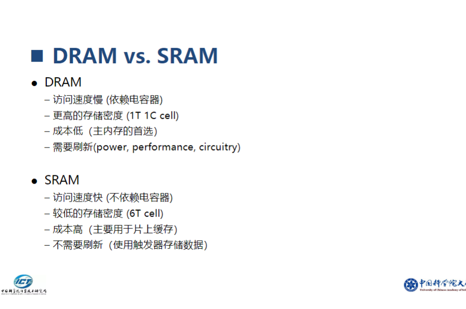

# 第三章 存储器与高速缓存结构

## 1. 存储器层次结构

### 1.1 基本概念
- 存储器层次：从上到下速度递减、容量递增、成本递减
  - 速度：寄存器(ns级) > Cache(ns~几十ns) > 主存(几十ns~几百ns) > 辅存(ms级)
  - 容量：寄存器(KB级) < Cache(MB级) < 主存(GB级) < 辅存(TB级)
  - 成本：与速度成正比，与容量成反比
- 局部性原理：程序访问的关键原理
  - 时间局部性：最近访问过的数据可能近期再次被访问
    - 例如：循环中的变量会被多次访问
  - 空间局部性：访问某个数据时，其附近的数据也可能被访问
    - 例如：数组元素的连续访问

### 1.2 存储器层次
1. 寄存器(Registers)
   - 速度最快：访问时间<1ns
   - 容量最小：通常每个CPU核心几十到几百个寄存器
   - 直接与CPU交互：是CPU运算的主要工作区域
   - 类型：通用寄存器、专用寄存器、状态寄存器等

2. 高速缓存(Cache)
   - L1 Cache：
     - 容量：32KB~64KB
     - 访问延迟：2~4个时钟周期
     - 通常分为指令缓存(I-Cache)和数据缓存(D-Cache)
   - L2 Cache：
     - 容量：256KB~1MB
     - 访问延迟：10~20个时钟周期
     - 通常统一存储指令和数据
   - L3 Cache：
     - 容量：可达数MB到数十MB
     - 多核共享，提供更大的缓存空间

3. 主存储器(Main Memory)
   - 动态随机访问存储器(DRAM)
     - 需要定期刷新以保持数据
     - 集成度高，成本相对较低
   - 特点：
     - 容量：现代计算机通常8GB~32GB或更多
     - 访问延迟：50~100ns
     - 带宽：数十GB/s
   - 易失性：断电后数据丢失

4. 辅助存储器
   - 硬盘(HDD)：
     - 机械结构，寻道时间长
     - 容量大，价格低
     - 读写速度：100~200MB/s
   - 固态硬盘(SSD)：
     - 无机械部件，随机访问快
     - 读写速度：500MB/s~数GB/s
     - 寿命有限，写入次数受限
   - 特点：
     - 非易失性：断电后数据保持
     - 容量：TB级别
     - 访问延迟：ms级别
5. CPU访问存储系统的指标
    - 命中时间(Hit Time)：从CPU发出访问请求到Cache命中所用的时间
    - 未命中时间(Miss Time)：从CPU发出访问请求到主存命中所用的时间
    - 未命中率(Miss Rate)：未命中次数与访问次数的比率
    - 未命中开销(Miss Penalty)：未命中时间与命中时间的差值

    - **延迟时间(Latency)**：单次存储器的访问时间

        存储器访问时间>>处理器时钟周期

    - **带宽(Bandwidth)**：单位时间对存储器访问的次数

        如果每条指令的执行需要m次访存操作

            -> 总计每条指令需要m+1次存储器访问（包括一次取指令）
            
            -> 如果CPI = 1,则每个指令周期需要m+1次访存操作
        
    - **能耗(Energy)** 单次存储器访问的能耗（nJ）

6. **多级存储的目的是通过合理组织和层次化存储系统，提高计算机系统的性能、效率和容量，以满足不同应用场景下的需求**
    - 策略（Strategy）：使用小容量、高速存储器作为Cache，来降低平均访存延迟
    - 缓存（Cache）是一种减少访存延迟的机制，它基于经验观察，即处理器进行的内存访问模式通常是高度可预测的
7. **常见的可预测模式**
- **空间局部性（ Spatial Locality ）：如果一个地址被访问过，在不久的将来该地址的临近地址很可能会被访问到**
    - 以由地址连续的若干个字构成的块为单位，从低层复制到上一层
- **时间局部性（ Temporal Locality ）：如果一个地址被访问过，在不久的将来很可能还会被访问**
    - 保持最近访问的数据项最接近微处理器
    
8. 一个经典计算题

- **注意计算方式、TM、TA**

## 2. 高速缓存(Cache)结构

### 2.0 基本概念
- **小而快(SRAM)的存储技术**
    - 存储正在访问的部分指令和数据
- **作用：减少平均访存时间**
    - 通过保持最近访问的数据在处理器附件，来挖掘**时间局部性**
    - 通过以块(Block/Cache Line)为单位在不同层次，从低层复制到高层移动，来挖掘**空间局部性**
- **主要目标**
    - 减少平均访存时间
    - 提高数据访问速度
    - 降低系统能耗
    - 提高系统可靠性
    - **提高处理器访存速度**
    - **降低存储系统成本**

### 2.0.1 Cache工作流程

### 2.1 基本组成
- Cache行(Cache Line)：
  - 典型大小：64字节或128字节
  - 包含：数据块、标记、状态位
  - 是数据传输的基本单位
- 标记(Tag)：
  - 用于标识数据的来源地址
  - 包含主存地址的高位部分
- 有效位(Valid Bit)：
  - 1位标志位
  - 1表示数据有效，0表示无效
- 替换算法：
  - 目的：在Cache满时选择要替换的行
  - 需要平衡效率和实现复杂度

### 2.2 映射方式(Cache 基础知识1)
- **当要把一个块(Block)从主内存装入Cache时，需要确定它在Cache中的位置，如何放置的问题**
- **三种映射规则**，来确定块 (Block) 应该存储在Cache中的哪个位置

#### 2.2.1 直接映射(Direct Mapping)：最简单的映射规则，每个主存块只能映射到Cache中的一个特定位置
- 特点：
  - 每个主存块只能映射到特定的Cache行
  - 映射公式：Cache中块地址(j) = 主存块地址(i) MOD Cache中的块数(M)
  - 硬件简单，成本低
  - 冲突概率高
- 优缺点：
  - 优点：
    - 硬件实现简单
    - 查找速度快
  - 缺点：
    - 冲突失效率高
    - 空间利用率可能低
- 抖动现象：
  - 当频繁访问映射到同一Cache行的不同主存块时发生
  - 会导致频繁的替换操作，严重影响性能

#### 2.2.2 全相联映射(Fully Associative)：在全相联映射中，主存块可以映射到Cache中的任何位置，没有位置限制

- 特点：
  - 主存块可以映射到任意Cache行
  - 需要并行比较所有Cache行的标记
  - 硬件复杂度最高
- 优缺点：
  - 优点：
    - 冲突概率最低
    - Cache空间利用率最高
    - 不会发生缓存冲突，提高了缓存利用率
  - 缺点：
    - 硬件成本高，额外的硬件来进行位置查找，因此会增加Cache的访问时间；
    - 访存时间显著增加，需要并行比较所有缓存块的标签（tag）
- 实现：
  - 使用内容寻址存储器(CAM)
  - 并行比较所有标记
  - 替换算法灵活多样

#### 2.2.3 组相联映射(Set Associative)：Cache被划分成若干组，每组包含多个位置块(Way), *主存中每一块可以被放置在Cache中唯一的一个组的任意一个位置*
- **是直接映射和全相联的折中方案，组间直接映射，组内全相联**
- 若一个Cache组由N个位置块构成，我们称N路组相联
  - n路组相联：每组包含n个Cache行
  - 常见的路数：2路、4路、8路、16路
  - 组的选择使用直接映射方式
  - 组内使用全相联映射方式
  - 若cache中有G组，则主存中的第i块的组号K
  - K = i MOD(G)
- 优点：
  - 较好的平衡了性能和成本
  - 冲突概率适中
  - 硬件复杂度适中

### 2.30 查找方法（Lookup）（Cache 基础知识2）
- cache中每一个数据块Block都包含从主存储器中获取到一部分数据，包括三个重要字段：**标记(Tag)、索引(Index)、数据(Data)**
    - Tag是用于唯一标记缓存块的字段
        - 用于确定所需数据是否在缓存中
    - Index用于确定数据在Cache中的位置
        - 通常是一个数字，指示Cache行号
    - Data是存储在Cache中的实际数据
        - 从主存中复制到Cache的数据块
        - 
        - 

### 2.3 替换算法

#### 2.3.1 常见替换策略
1. LRU(Least Recently Used)
   - 工作原理：
     - 记录每个Cache行的访问时间
     - 替换最长时间未使用的行
   - 实现方式：
     - 计数器法
     - 栈实现
     - 老化算法
   - 特点：
     - 命中率高
     - 硬件开销大
     - 适合小容量Cache

2. FIFO(First In First Out)
   - 工作原理：
     - 维护一个队列记录进入顺序
     - 替换最早进入的Cache行
   - 实现：
     - 使用计数器或环形队列
     - 硬件开销较小
   - 特点：
     - 实现简单
     - 性能一般
     - 可能出现Belady异常

3. Random
   - 工作原理：
     - 随机选择要替换的Cache行
   - 实现：
     - 使用随机数生成器
     - 硬件开销最小
   - 特点：
     - 实现最简单
     - 性能不稳定
     - 适合大容量Cache

#### 2.3.2 写策略
1. 写直达(Write Through)
   - 工作流程：
     - 数据同时写入Cache和主存
     - 保证数据一致性
   - 优缺点：
     - 优点：
       - 实现简单
       - 主存始终保持最新
     - 缺点：
       - 写操作慢
       - 总线占用率高

2. 写回(Write Back)
   - 工作流程：
     - 只写入Cache
     - 使用脏位(Dirty Bit)标记修改
     - 替换时才写回主存
   - 优缺点：
     - 优点：
       - 写操作快
       - 减少总线流量
     - 缺点：
       - 实现复杂
       - 需要额外的脏位存储

## 3. 高速缓存性能优化

### 3.1 提高命中率
- 优化Cache容量和组织方式：
  - 合理选择Cache大小
  - 优化映射方式和相联度
  - 调整Cache行大小
- 使用多级Cache结构：
  - 平衡访问速度和容量
  - 优化各级Cache参数
- 预取技术：
  - 指令预取
  - 数据预取
  - 自适应预取
- 优化替换算法：
  - 改进LRU算法
  - 使用智能预测
  - 考虑访问模式

### 3.2 减少访问延迟
- 流水线化Cache访问：
  - 将访问过程分解为多个阶段
  - 提高访问吞吐率
- 非阻塞Cache：
  - 支持多个未完成的访问
  - 利用访问并行性
- 关键字优先：
  - 优先返回请求的字节
  - 减少等待时间
- 多端口Cache：
  - 支持并行访问
  - 提高带宽

### 3.3 降低功耗
- 分区技术：
  - 选择性开启Cache区域
  - 根据负载调整大小
- 选择性缓存：
  - 识别重要数据
  - 避免缓存无用数据
- 动态调整Cache大小：
  - 根据工作负载调整
  - 关闭闲置部分
- 电源管理策略：
  - 动态电压频率调节
  - 休眠机制

## 4. 新型存储技术

### 4.1 新型存储器
- 非易失性存储器(NVM)：
  - 结合DRAM速度和闪存非易失性
  - 例如：3D XPoint技术
- 3D堆叠存储器：
  - 通过TSV技术垂直堆叠
  - 提高密度和带宽
- 相变存储器(PCM)：
  - 利用相变材料存储
  - 高密度、非易失
- 磁阻存储器(MRAM)：
  - 利用磁性材料存储
  - 快速、非易失

### 4.2 新型Cache架构
- 智能Cache：
  - 自适应调整策略
  - 机器学习优化
- 可重构Cache：
  - 动态调整参数
  - 适应应用需求
- 共享Cache：
  - 多核心共享
  - 动态分配策略
- 分布式Cache：
  - 网络化存储
  - 协同缓存

### 4.3 未来发展趋势
- 存储层次融合：
  - 打破传统层次界限
  - 统一存储管理
- 近存计算：
  - 在存储器中进行计算
  - 减少数据移动
- 智能存储管理：
  - AI辅助优化
  - 自适应调节
- 新型存储介质：
  - 量子存储
  - 生物存储
  - 光学存储 